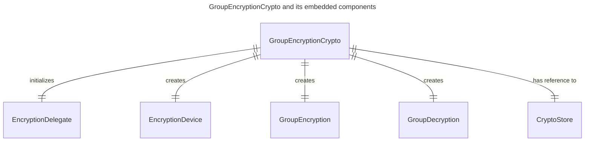
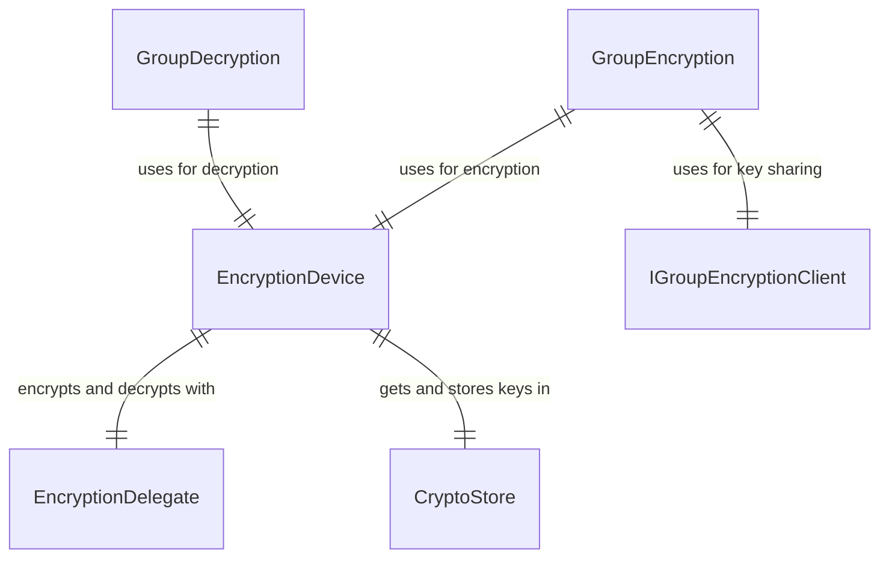
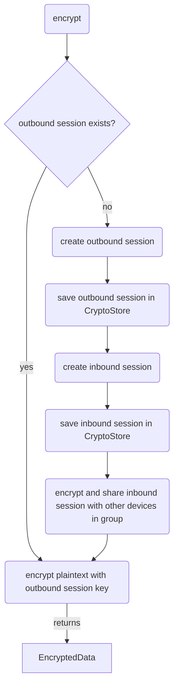
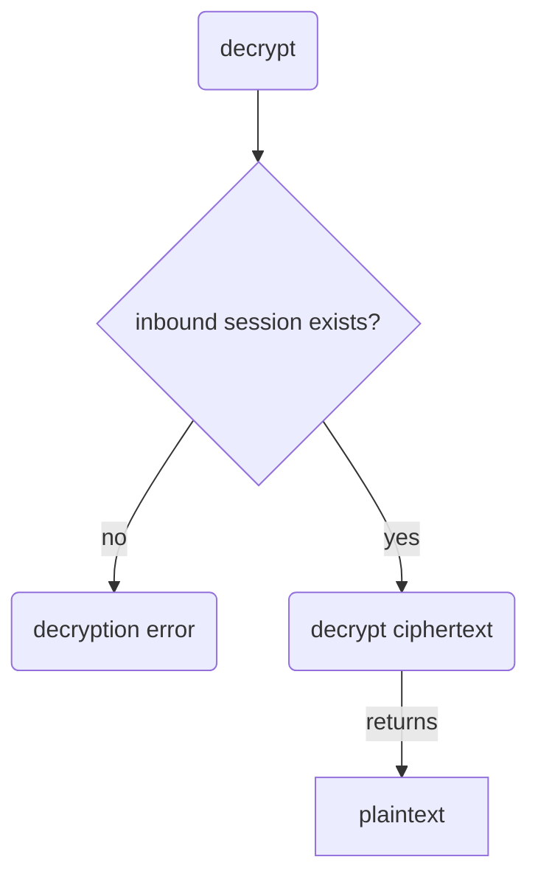
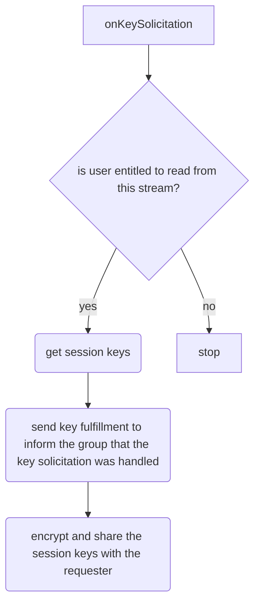

### What is the Towns Encryption Protocol?

The Towns protocol supports end-to-end encryption and decryption between
a group of user devices. When a user (Bob) wants to send a new message to a
group of users, Bob's device first creates a new group session. Using the
outbound session key, it encrypts the message. Then the encrypted message is
sent to the group.

When a recipient (Alice) gets the encrypted message, her device will start a
new group session to import the inbound session key, and then use it to decrypt
the message.

But how does Alice's device gets the inbound session key in the first place?

The following section describes the inner workings of the group encryption
protocol.  It explains how Alice's device makes a **`key solicitation request`**
to get missing session keys. It also covers how other devices in the group can
**`share session keys`** in a process called **`key fulfillment`**
after checking that Bob is a group member.

Before diving into the `key solicitation`, `key fulfillment`, and `key sharing`
algorithms, let's first take a look at the core entities in the group encryption
protocol.

### Core entities in the Towns Encryption Protocol

**`GroupEncryptionCrypto`** : The main interface of the protocol. It
initializes the **`EncryptionDelegate`**. This class "delegates" the
encryption and decryption operations to the
[`olm` library from the Matrix.org foundation](<https://www.npmjs.com/package/@matrix-org/olm>).
This library implements the Double Ratchet algorithm. See notes on [supported algorithm](#supported-algorithm) for future plans.

The Towns Encryption Protocol uses this library to create a group session, and
perform device-to-device encryption using the session keys.

The `GroupEncryptionCrypto` creates a `GroupEncryption`, a
`GroupDecryption`, and an `EncryptionDevice` to handle the group encryption
protocol:



- **`GroupEncryption`** : handles group encryption using session keys. Outgoing
messages are encrypted with outbound session keys.
- **`GroupDecryption`** : handles group decryption using session keys. Incoming
messages are decrypted with inbound session keys.
- **`EncryptionDevice`** : interfaces with the `EncryptionDelegate` to perform
cryptographic operations. It also uses the `CryptoStore` to get and save the
inbound / outbound session keys.



### Encrypting a message with GroupEncryption

A device will need an outgoing session to encrypt a message to the group. If
it does not already have a session, it must create one. In addition, it will
also create an inbound session. The inbound session is encrypted and sent to
other devices in the group.



### Decrypting a message with GroupDecryption



### Key solicitation and key fulfillment

If a device does not have any session keys, it can make a `KeySolicitation`
request to the group. Any device that is "online" at that moment can share its
known session keys, and send a `KeyFulfillment` response to inform others in the
group that the `KeySolicitation` request has already been fulfilled.

Continuing our example, suppose Alice's device does not have the session key
to decrypt a message from Bob. Alice's device posts a `KeySolicitation` request
to the stream. Bob's device happens to be online at the moment. When it sees the
request, it processes the request as follows:



Thus, Alice's device is able to get the required session keys for decryption.

## Build

See [towns-tutorials/encryption-import](https://github.com/river-build/towns-tutorials/tree/main/encryption-import) for a tutorial on how to import the Towns Encryption
npm package.

---

## Footnotes

### Supported algorithm

> The Towns Encryption Protocol is designed to support new algorithms. There is
an `algorithm` field in the protocol definition. The current value is
`r.group-encryption.v1.aes-sha2`. This means that the protocol is using the
`olm` Double Ratchet library for device-to-device session encryption.
This field can be set to new algorithms to support future needs.

```protobuf
// protocol.proto
message EncryptedData {
    // ...
    /**
    * Encryption algorithm  used to encrypt this event.
    */
    string algorithm = 2;
    // ...
}
```
