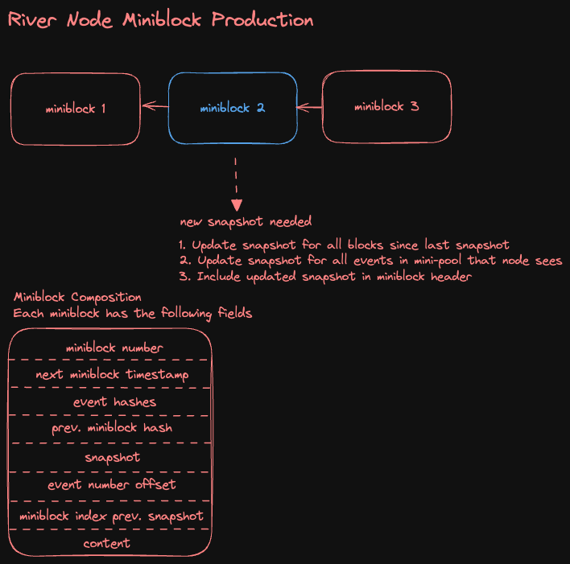

### Event Ordering

River nodes are responsible for assembling events from the stream's `minipool` into `miniblocks` that are sealed blocks of event hashes pointing to the previous block hash.

Coarse ordering of events in a given stream is achieved due to the sequential nature of block production. However, for certain events, such as a stream's membership roster, strict ordering is required.

As a concrete example, take the case where Alice `joins` a space at local time `t1` then `leaves` the space at time `t2`. We should expect a read of the membership roster after the `leave` event to exclude Alice. We should also expect Alice to have been a member in the coarse grained time interval `t2 - t1` between when the `join` and `leave` events were included by a node each in a mini-block. Since different River Nodes may have seen the `join` and `leave` events, there is no way to guarrantee that they would be included in mini-blocks with a temporal sequence equivalent to the sequence in which the actions were taken.

Therefore, to achieve strict ordering under the River protocol a technique called **Snapshotting** is undertaken at the block boundary for each stream. A positive side effect of Snapshotting is that disk utilisation is reduced for nodes as snapshots are updated in-place.

### Snapshot Production

Snapshots are taken every N events at the block boundary, which occurs when a node that is elected by `RANDDAO` to propose the next block creates and appends a new signed `miniblock` to the stream's `minichain`.

> Though miniblocks are comprised of event hashes, snapshot data is stored unhashed in miniblock to allow for fast client syncs of `state` events from miniblock which is rolled up onto River Chain.



### Data Schema

Each payload type described in the protocol may be subject to snapshotting. Nodes stand ready to snapshot events for streams they are assigned to when they are elected as block proposers. Clients can be assured of strict ordering of `state` events and other events that would benefit from strict ordering at the block boundary and data compaction.

Typically, `maps` are used to store snapshot data in nodes as the data itself is amenable to `key -> value` pairs.

Below is the `Snapshot` messages defined in the protocol protobuf that nodes adhere to.

```protobuf
/**
* Snapshot contains a summary of all state events up to the most recent miniblock
*/
message Snapshot {

    CommonPayload.Snapshot common = 1;

    // Snapshot data specific for each stream type.
    oneof content {
        SpacePayload.Snapshot space_content = 101;
        ChannelPayload.Snapshot channel_content = 102;
        UserPayload.Snapshot user_content = 103;
        UserSettingsPayload.Snapshot user_settings_content = 104;
        UserDeviceKeyPayload.Snapshot user_device_key_content = 105;
        MediaPayload.Snapshot media_content = 106;
        DmChannelPayload.Snapshot dm_channel_content = 107;
        GdmChannelPayload.Snapshot gdm_channel_content = 108;
        UserToDevicePayload.Snapshot user_to_device_content = 109;
    }
}
```

Take `SpacePayload.Snapshot` for example. It defines 4 maps and an inception event, which is an immutable singleton for each Space stream. Every time a node is tasked with proposing a block for a stream, if enough events have accrued (controlled on a stream-by-stream setting in the inception payload of each stream, `MinEventsPerSnapshot`), a snapshot will be taken as part of miniblock construction potentially updating all 4 maps in place and including the mutated snapshot object in the miniblock.

> The reason snapshots take place after at least `MinEventsPerSnapshot` events have been seen by the node since the last snapshot is that taking a snapshot is a global memory intensive operation for a node. Updating the snapshot for every event would increase memory complexity of miniblock creation to the complexity of including message events. By doing so periodically in batches, strict ordering latency is traded for node memory efficiency.

```protobuf
message SpacePayload {
    message Snapshot {
        // inception
        Inception inception = 1;
        // streamId: Channel
        map<string, Channel> channels = 2;
        // userId: Membership
        map<string, Membership> memberships = 3;
        // userId: Username
        map<string, WrappedEncryptedData> usernames = 4;
        // userId: Displayname
        map<string, WrappedEncryptedData> display_names = 5;
    }
}
...
```
