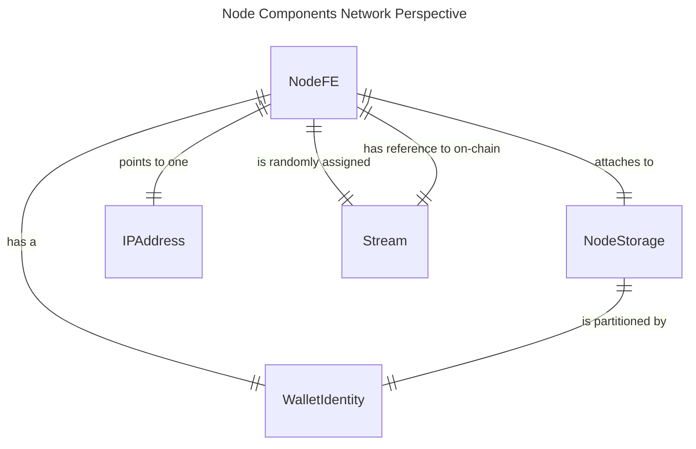
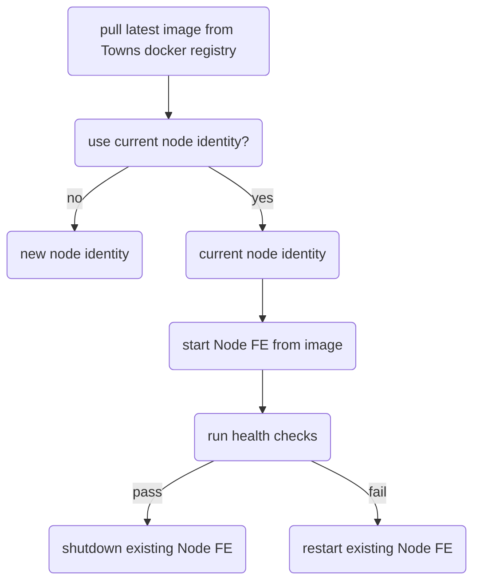

<Note>It is assumed that the node operator wallet registered on Base has been bridged to Towns Chain by the DAO and that the node operator has warm access to this wallet to perform node operations to register, and update a fleet of nodes.</Note>

Nodes will need to be upgraded as part of maintenance operations to keep up-to-date with version upgrades and fixes. Upgrading can be accomplished from source or docker image. This guide will focus on upgrading from the Towns Lodge public ecr registry: `public.ecr.aws/h5v6m2x1/river`, which hosts docker images built for version upgrades and hotfixes across testnet and mainnet.

### Node Components

The below diagram describes component relations between Node FE (Frontend), Node Identity, Node Storage, IP Address, Stream from the network's perspective assuming an [Operational](https://github.com/river-build/river/blob/main/contracts/src/river/registry/libraries/RegistryStorage.sol#L33) Node FE as described by the RiverRegistry on-chain state.



### Upgrade a Node

Upgrading Node FE software can be achieved with a new node identity or existing node identity. 

<Note>It is currently reccommended to upgrade node software with existing node identity that is stored in RiverRegistry. Once Stream rebalancing is implemented, upgrades that create and register a new node identity can be safely enacted without potential stream downtime.</Note>

The below assumes an upgrade path from docker. Futures guides will focus on upgrades from source. 



### Upgrading a Node with existing identity steps

The below steps further describe the reccommended path to upgrade Node FE from the RHS of the above flowchart. 

<Note>This guide assumes the node operator performing the upgrade has access to an existing node's wallet private key as well as credentials to connect to a write instance of the Node Storage instance.</Note>

<Steps>
  <Step title="Pull latest river image">
  ```bash
  $ docker pull public.ecr.aws/h5v6m2x1/river:testnet
  ```
  </Step>
  <Step title="Start Node FE">
  Once you've pulled the latest image and have set your environment variables, you can start your Node FE docker container within your network configuration.

  <Warning>Ensure you are starting your node's container with `SKIP_GENKEY=true` otherwise a new node wallet will be created and attached to your Node storage.</Warning>

  If you have any load balancers configured, please ensure that the public IP pointed to by the node identity's node url (found in RiverRegistry) routes to the new pid for this Node FE.
  </Step>
  <Step title="Run health checks">
  If you've exposed metrics, you should have a separate service running on `http:/localhost:8081/metrics` that you can inspect to ensure the Node FE is up and running properly.
  </Step>
  <Step title="Shutdown old Node FE">
  If you've come this far, you have a new Node FE pid running attached to your Node Storage Postgres DB meaning the node is ready to serve writes. Furthermore, your node URL attached to your node's identity should be resolving to the IP of your node.

  At this point, you can safely shutdown your old Node FE as it is not proxying any traffic for the network.
  </Step>
</Steps>