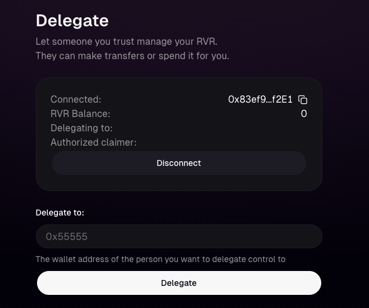

## Base Mainnet

River tokens are used in the Node Operator Registry and River DAO contracts on [Base](https://base.org).

River tokens can be delegated by calling the `delegate()` function on the Base [River.sol](https://github.com/river-build/river/blob/main/contracts/src/tokens/river/base/River.sol) contract. An interface is provided at https://river.build/delegate.

Connect your wallet, paste the address of the Node Operator or Space address you want to delegate to, and submit the transaction.

<Info>
Always check that your Node Operator address is a valid node operator in the network. You can verify this by checking the node status page at https://river.build/status.
</Info>

Any tokens received from network operation will be claimable by calling the `claim()` function from the same wallet on the RewardsDistribution.sol contract. And interface will be provided at https://river.build/claim.

## Ethereum Mainnet

River tokens held on Ethereum mainnet can also be delegated at https://river.build/delegate.

Post-delegation, the details (such as delegating wallet, operator wallet, token quantity) are bridged to the Base network and referenced in the Node Operator Registry using the [L1CrossDomainMessenger](https://docs.optimism.io/builders/app-developers/bridging/messaging) contract.

<Warning>
Tokens rewarded for network operation are only claimable on Base. This means in the case where a user delegating from Ethereum mainnet doesn’t own the same wallet address on both Ethereum mainnet and Base, they must authorize a different wallet address that they own on Base which can claim on behalf of the Ethereum mainnet wallet.
This can be done at https://river.build/delegate by calling the `authorizeClaimer(address)` function FROM the Ethereum Mainnet wallet that delegated tokens and passing in the Base wallet address that will claim tokens.

</Warning>
